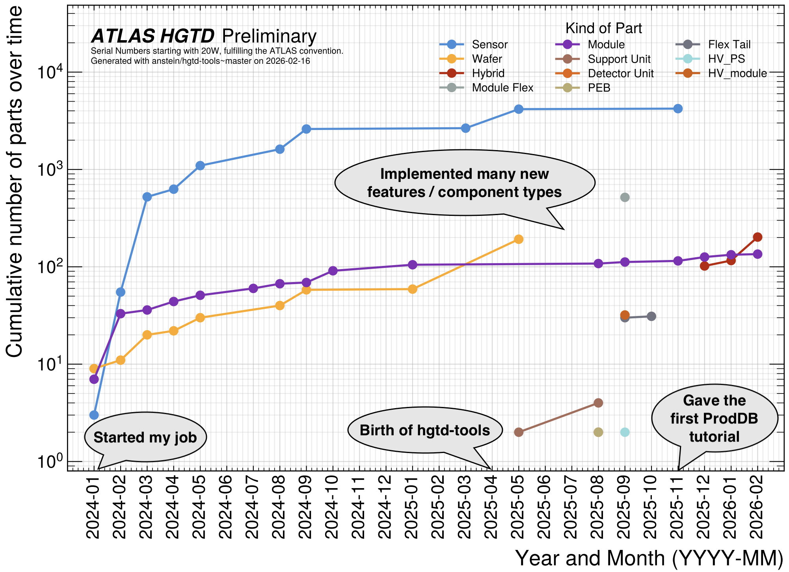
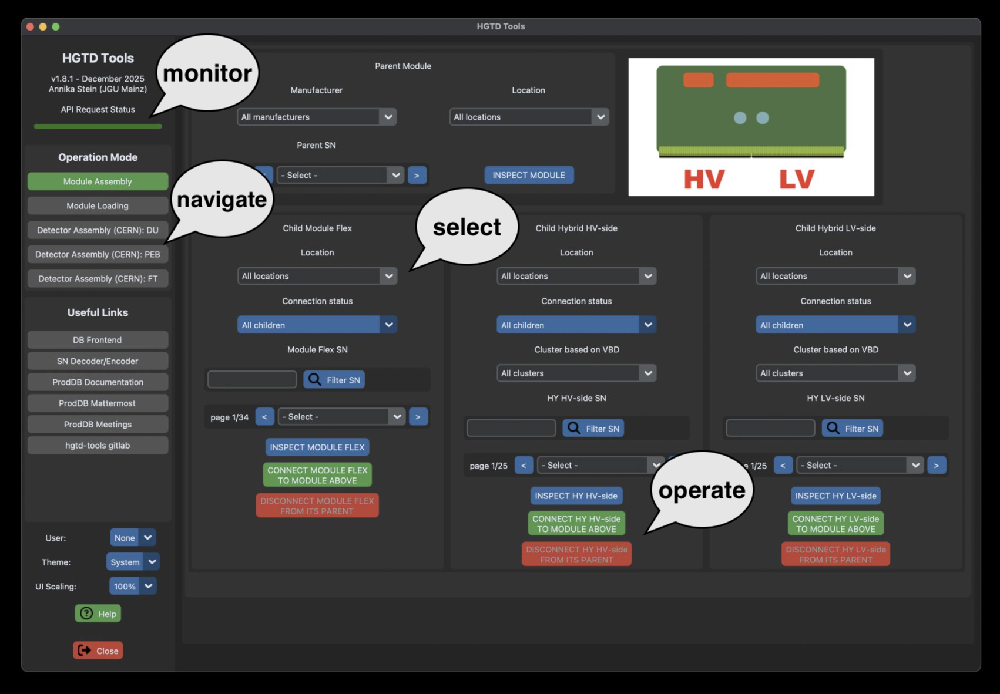
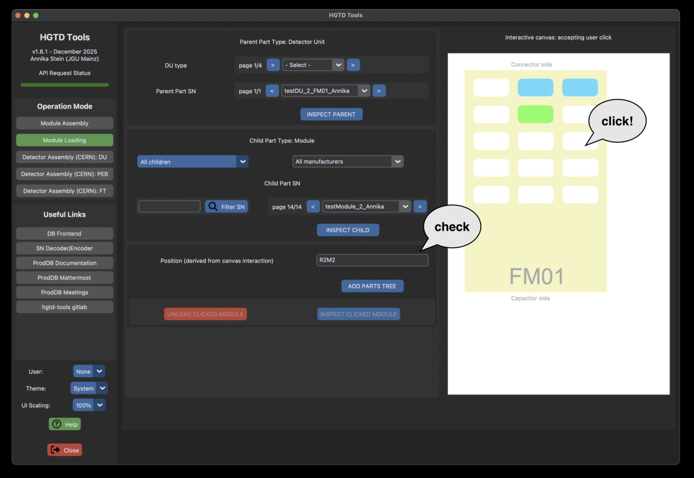
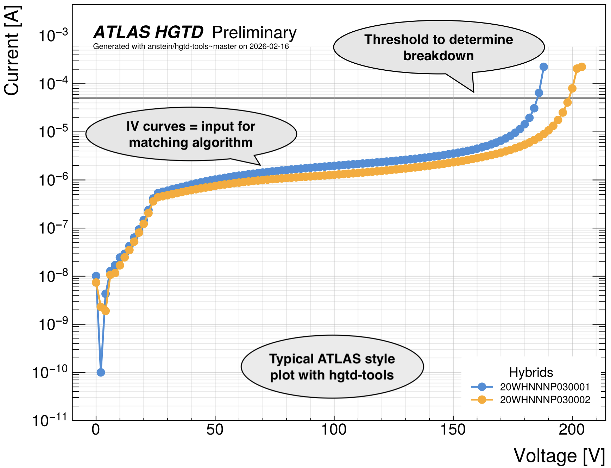
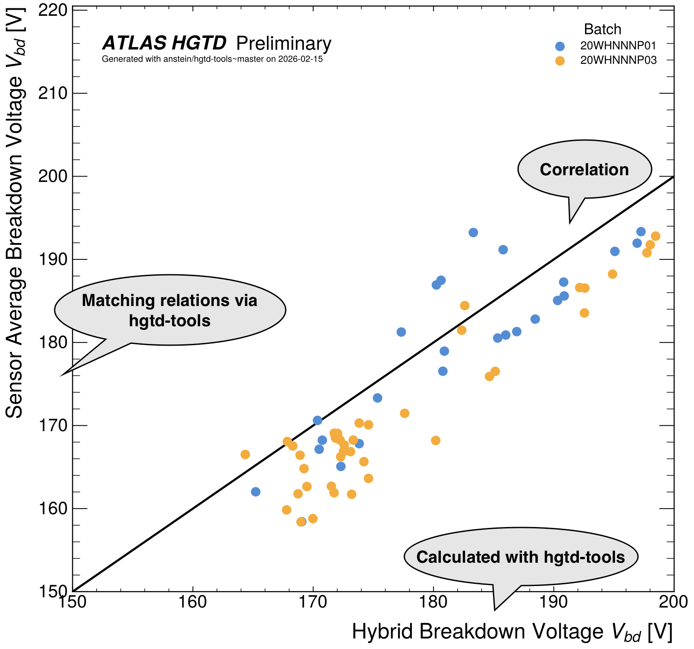
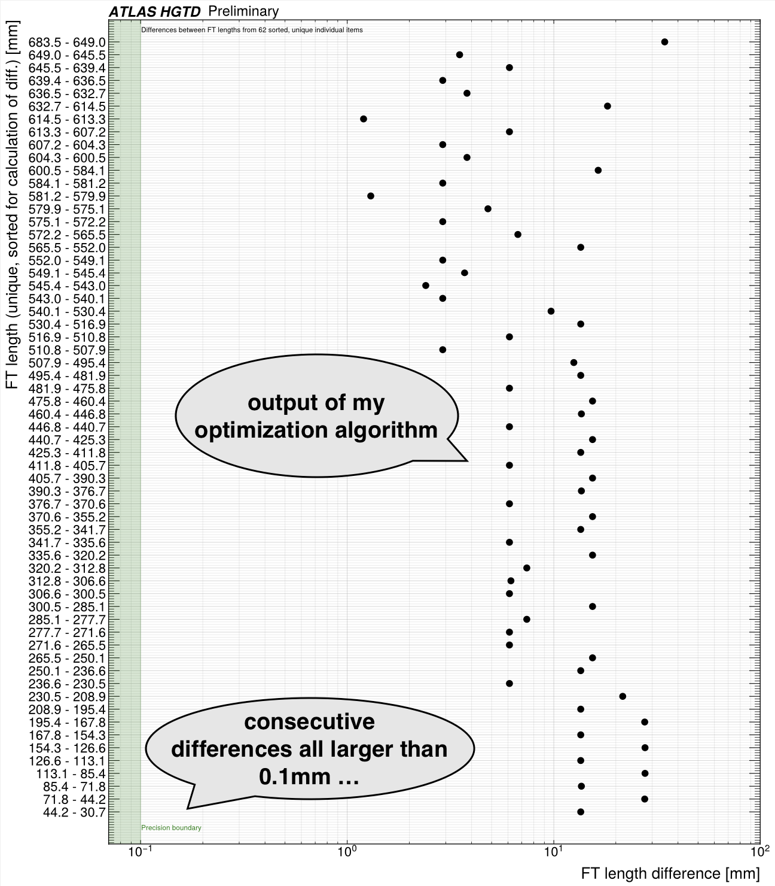

# Welcome!

!!! info ""
    I am an **experimental particle physicist**, specializing in **machine learning applications** and data analysis of proton-proton collision data of the Large Hadron Collider at CERN.

    Currently, my research is targeted at (Run 3) **data analysis** with the **ATLAS experiment** (top quark physics (cross section, charge / energy asymmetry) and exotics (ALPs+tops with calorimeter jets)) and **R&D** of the High Granularity Timing Detector (HGTD) for HL-LHC / Run 4 with a special interest in database development and design / testing of Flex Tails (flexible PCBs).

    I enjoy building highly performant and reliable analysis software with comprehensive documentation, as well as user interfaces that my collaborators enjoy. Further, I am a strong advocate of consistency, automation and optimization.

## Recent Highlights

### hgtd-tools

!!! info ""

    - <em>HGTD Public Plots</em> 
        <a href="https://twiki.cern.ch/twiki/bin/view/AtlasPublic/HGTDPublicPlots#Production_Database" target="_blank">https://twiki.cern.ch/twiki/bin/view/AtlasPublic/HGTDPublicPlots#Production_Database</a> 
        2026

    !!! abstract

        
Results from pre-production of HGTD parts and their implementation in the Production Database along with the novel user interfaces, especially in "hgtd-tools", are presented.

        
<em>Contribution: Prepared the software to upload and analyse production data for module assembly, module loading and detector assembly. Calculated / optimized the flex tail categories, setup the monitoring dashboard, reporting, gitlab CI pipeline, invented the algorithms for hybrid clustering and developed the python API client including CLI and GUI.
        </em>

  

    <!-- Bild 1 -->
    

      

      
    

    <!-- Bild 2 -->
    

      

      
    

    <!-- Bild 3 -->
    

      

      
    

    <!-- Bild 4 -->
    

      

      
    

    <!-- Bild 5 -->
    

      

      
    

    <!-- Bild 6 -->
    

      

      
    

  

  <!-- Steuerung -->
  <button id="prev-btn" style="position: absolute; top: 50%; left: 15px; transform: translateY(-50%); cursor: pointer; background: rgba(255,255,255,0.2); backdrop-filter: blur(5px); color: white; border: none; width: 45px; height: 45px; border-radius: 50%; font-size: 20px; transition: 0.3s; z-index: 10;">❮</button>
  <button id="next-btn" style="position: absolute; top: 50%; right: 15px; transform: translateY(-50%); cursor: pointer; background: rgba(255,255,255,0.2); backdrop-filter: blur(5px); color: white; border: none; width: 45px; height: 45px; border-radius: 50%; font-size: 20px; transition: 0.3s; z-index: 10;">❯</button>

### TopCPToolkit

!!! info ""

    { width="100", align=right }

    - <em>Software</em> 
        Gitlab: <a href="https://gitlab.cern.ch/atlas/amg/software/TopCPToolkit" target="_blank">https://gitlab.cern.ch/atlas/amg/software/TopCPToolkit</a> 
        Gitlab: <a href="https://gitlab.cern.ch/atlas/amg/software/HowToExtendTopCPToolkit" target="_blank">https://gitlab.cern.ch/atlas/amg/software/HowToExtendTopCPToolkit</a> 
        Zenodo:  

        2026

    !!! abstract

        
TopCPToolkit is an ntuple production framework for analysing data from LHC Run 2 and Run 3. It is built around common CP and analysis algorithms in release 25 of the central athena software framework of the ATLAS Collaboration.

        
<em>Contribution: Development and maintenance of software, user support, tutorials as part of top reconstruction convener role, including core team coordination.
        </em>

## Further Navigation / Overview

- :information: On my website you can find some personal information, organized into different areas like [education and qualifications](education.md), or [experience (teaching / work)](work.md).
- :gem: There is also a page summarizing my [publications](publications.md), [awards](awards.md), and I also list [talks, theses and more](talks_theses.md) with additional material.
- :sparkles: If you are interested in my [other activities](activities.md) (mostly related to solving twisty puzzles fast, =speedcubing),
you will also find specialized links that point you to my contributions in that field.
- :telephone: Don't hesitate to [contact](contact.md) me!

